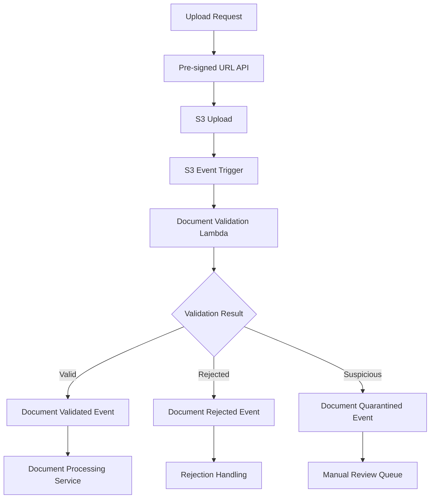

# RAG Document Ingestion Service

A serverless document ingestion service for the RAG (Retrieval-Augmented Generation) system, built following OndemandEnv platform patterns similar to the coffee-shop services.

## 🏗️ Architecture Overview

This service follows the coffee-shop pattern, using `@odmd-rag/contracts-lib-rag` as a devDependency for contract integration. It implements the `RagDocumentIngestionBuild` contract and provides:

- **Document Upload API**: Secure pre-signed URL generation for file uploads
- **Document Validation**: Comprehensive validation including security scanning
- **Event Publishing**: EventBridge events following schema contracts
- **S3 Integration**: Automated processing via S3 event notifications
- **Quarantine System**: Security isolation for suspicious documents

### Technology Stack

- **AWS Lambda**: Serverless compute for document processing
- **Amazon S3**: Document storage with lifecycle management
- **Amazon EventBridge**: Event-driven communication
- **API Gateway**: RESTful upload endpoints
- **AWS CDK**: Infrastructure as Code

## 📋 Service Contracts

Implements the following contracts from `contractsLib-rag`:

### Event Producer: `DocumentValidationEventProducer`
- **EventBridge Bus**: `documentValidationEvents.eventBridge`
- **Schema Contracts**:
  - `documentValidatedEventSchema` - Documents ready for processing
  - `documentRejectedEventSchema` - Documents failing validation
  - `documentQuarantinedEventSchema` - Documents requiring manual review

### Environment Structure
```typescript
// Development environment
ragContracts.ragDocumentIngestionBuild.dev.documentValidationEvents

// Production environment
ragContracts.ragDocumentIngestionBuild.prod.documentValidationEvents
```

## 🚀 Getting Started

### Prerequisites

- Node.js 18+
- AWS CLI configured
- AWS CDK v2 installed

### Installation

```bash
# Install dependencies
npm install

# Build TypeScript
npm run build

# Run tests
npm test

# Synthesize CDK template
npm run synth
```

### Deployment

```bash
# Synthesize CDK templates (development)
npm run cdk-synth

# Deploy all stacks
npm run cdk-deploy
```

## 📊 API Endpoints

### POST /documents/upload-url

Generate a pre-signed URL for secure document upload.

**Request:**
```json
{
  "fileName": "document.pdf",
  "contentType": "application/pdf",
  "tags": ["research", "2024"],
  "category": "academic",
  "priority": "normal"
}
```

**Response:**
```json
{
  "uploadId": "uuid-v4",
  "uploadUrl": "https://s3.amazonaws.com/...",
  "fields": {
    "Content-Type": "application/pdf",
    "key": "uploads/2024-01-15/uuid/document.pdf"
  },
  "uploadInstructions": {
    "method": "POST",
    "maxFileSize": 104857600,
    "expiresIn": 300,
    "allowedContentTypes": ["application/pdf", "..."]
  }
}
```

### GET /documents/{documentId}/status

Check document processing status.

**Response:**
```json
{
  "documentId": "uuid-v4",
  "status": "processing",
  "lastUpdated": "2024-01-15T10:30:00Z",
  "processingStage": "validation",
  "estimatedCompletion": "2024-01-15T10:35:00Z"
}
```

## 📝 Document Validation

### Supported File Types

| Type | MIME Type | Max Size | Features |
|------|-----------|----------|----------|
| PDF | `application/pdf` | 100MB | OCR, Image extraction |
| DOCX | `application/vnd.openxmlformats...` | 100MB | Text extraction |
| Text | `text/plain` | 100MB | Direct processing |
| HTML | `text/html` | 100MB | Content parsing |
| Markdown | `text/markdown` | 100MB | Structured content |
| CSV | `text/csv` | 100MB | Tabular data |
| JSON | `application/json` | 100MB | Structured data |

### Validation Rules

1. **File Size Check**: Maximum 100MB
2. **MIME Type Validation**: Only supported types allowed
3. **Extension Consistency**: File extension must match MIME type
4. **Content Analysis**: Security scanning for malicious content
5. **Structure Validation**: Format-specific validation (JSON syntax, PDF headers, etc.)
6. **Security Scanning**: Pattern detection for threats

### Security Features

- **Malicious Script Detection**: JavaScript, VBScript patterns
- **Executable Detection**: Binary signature scanning
- **Keyword Filtering**: Suspicious content identification
- **Quarantine System**: Automatic isolation of threats
- **Review Workflow**: Manual security review process

## 🔄 Event Flow



## 📊 Schema Contracts

### Document Validated Event

```typescript
interface DocumentValidatedEvent {
  eventId: string;
  timestamp: string;
  documentId: string;
  s3Bucket: string;
  s3Key: string;
  documentType: 'pdf' | 'docx' | 'txt' | 'html' | 'markdown' | 'csv' | 'json';
  fileSize: number;
  checksum: string;
  validationRules: string[];
  metadata: {
    uploadedBy: string;
    uploadedAt: string;
    originalFileName: string;
    contentType: string;
    tags?: string[];
    category?: string;
  };
  processingConfig: {
    priority: 'low' | 'normal' | 'high';
    chunkSize?: number;
    extractText: boolean;
    extractImages: boolean;
    ocrEnabled: boolean;
  };
}
```

### Document Rejected Event

```typescript
interface DocumentRejectedEvent {
  eventId: string;
  timestamp: string;
  documentId: string;
  s3Bucket: string;
  s3Key: string;
  rejectionReason: string;
  validationErrors: Array<{
    rule: string;
    message: string;
    severity: 'error' | 'warning';
  }>;
  metadata: {
    uploadedBy: string;
    uploadedAt: string;
    originalFileName: string;
    contentType: string;
    fileSize: number;
  };
}
```

### Document Quarantined Event

```typescript
interface DocumentQuarantinedEvent {
  eventId: string;
  timestamp: string;
  documentId: string;
  s3Bucket: string;
  s3Key: string;
  quarantineReason: string;
  securityFlags: string[];
  reviewRequired: boolean;
  metadata: {
    uploadedBy: string;
    uploadedAt: string;
    originalFileName: string;
    contentType: string;
    fileSize: number;
    detectedThreats?: string[];
  };
  reviewConfig: {
    reviewerRole: string;
    autoReleaseAfter?: string; // ISO duration
    escalationLevel: 'low' | 'medium' | 'high' | 'critical';
  };
}
```

## 🔧 Configuration

### Environment Variables

| Variable | Description | Default |
|----------|-------------|---------|
| `DOCUMENT_BUCKET_NAME` | S3 bucket for documents | - |
| `QUARANTINE_BUCKET_NAME` | S3 bucket for quarantined files | - |
| `EVENT_BUS_NAME` | EventBridge bus name | - |
| `MAX_FILE_SIZE` | Maximum file size in bytes | 104857600 |
| `PRESIGNED_URL_EXPIRY` | URL expiry in seconds | 300 |

### CDK Context

```json
{
  "environment": "dev",
  "account": "123456789012",
  "region": "us-east-2"
}
```

## 🧪 Testing

### Unit Tests

```bash
# Run all tests
npm test

# Run with coverage
npm run test:coverage

# Watch mode
npm run test:watch
```

### Integration Tests

```bash
# Deploy test stack
cdk deploy --context environment=test

# Run integration tests
npm run test:integration
```

### Contract Testing

Validates compliance with `contractsLib-rag` schema contracts:

```bash
npm run test:contracts
```

## 📈 Monitoring

### CloudWatch Metrics

- Lambda invocation counts and errors
- API Gateway 4xx/5xx responses
- S3 bucket operations
- EventBridge event delivery rates

### Alarms

- High error rates (> 1%)
- Processing latency (> 30s)
- Failed event deliveries
- Quarantine volume spikes

### Logs

- Structured JSON logging
- Request/response correlation IDs
- Security event tracking
- Performance metrics

## 🔐 Security

### IAM Policies

- Least privilege access
- Service-specific roles
- Cross-service permissions

### Data Protection

- S3 bucket encryption (SSE-S3)
- In-transit encryption (HTTPS/TLS)
- Access logging and auditing

### Security Scanning

- Content analysis patterns
- File signature validation
- Quarantine isolation
- Review workflows

## 🚀 Deployment Pipeline

### CI/CD Stages

1. **Build**: TypeScript compilation, dependency resolution
2. **Test**: Unit tests, integration tests, contract validation
3. **Security**: Dependency scanning, code analysis
4. **Package**: CDK synthesis, Lambda bundling
5. **Deploy**: Environment-specific deployment
6. **Verify**: Post-deployment testing

### Environment Promotion

```bash
dev → staging → production
```

## 🔗 Integration

### Downstream Services

- **Document Processing Service**: Consumes validated events
- **Embedding Service**: Processes document content
- **Vector Storage Service**: Stores embeddings
- **Knowledge Retrieval Service**: Searches documents

### Schema Registry

Registers concrete schemas with OndemandEnv platform:

```typescript
const schemaRegistry = new SchemaRegistry();
const metadata = schemaRegistry.exportMetadata();
// Registers with OndemandEnv platform
```

## 📚 Resources

- [OndemandEnv Platform Documentation](../../../docs/)
- [contractsLib-rag API Reference](../../../contractsLib-rag/docs/)
- [AWS CDK Documentation](https://docs.aws.amazon.com/cdk/)
- [AWS Lambda Best Practices](https://docs.aws.amazon.com/lambda/latest/dg/best-practices.html)

## 🤝 Contributing

1. Follow OndemandEnv coding standards
2. Maintain contract compliance
3. Include comprehensive tests
4. Update documentation
5. Validate security requirements

## 📄 License

This project is part of the OndemandEnv platform ecosystem. 