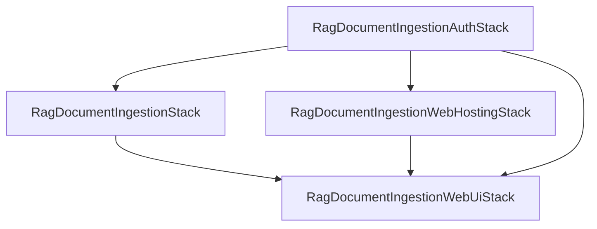
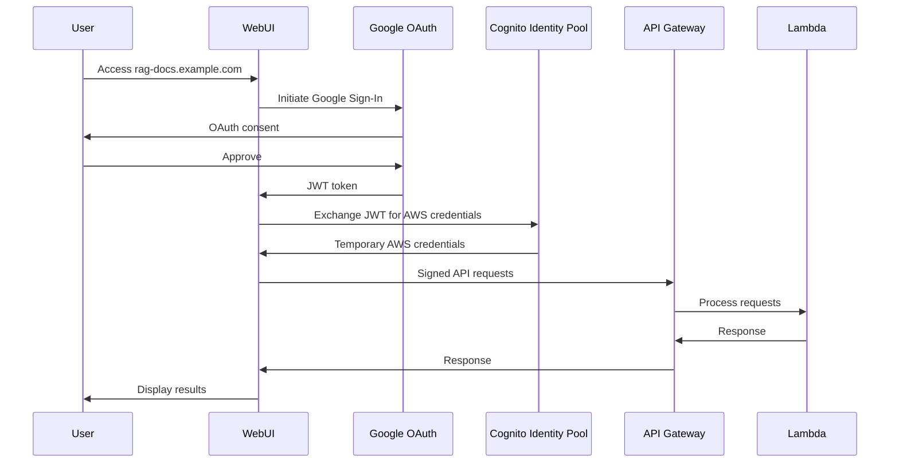
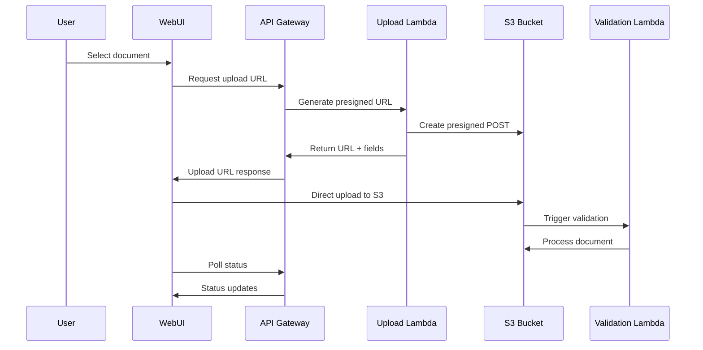

# RAG Document Ingestion - Web Hosting Architecture

## Overview

This document describes the web hosting architecture added to the RAG Document Ingestion Service, following the OndemandEnv platform patterns established in `user-auth1`.

## Architecture Components

### 1. Web Hosting Stack (`RagDocumentIngestionWebHostingStack`)

**Purpose**: Provides the infrastructure for hosting the web UI
**Location**: `lib/rag-document-ingestion-web-hosting-stack.ts`

**Components**:
- **S3 Bucket**: Stores the built web application assets
- **CloudFront Distribution**: CDN for global content delivery
- **Route 53 DNS**: Custom domain mapping (`rag-docs.{zoneName}`)
- **SSL Certificate**: Automatic HTTPS via ACM with DNS validation
- **Caching Strategy**: 
  - Static assets (JS, CSS, images): 7-day cache
  - HTML files and config: No cache (immediate updates)

**Key Features**:
- SPA routing support (404/403 → index.html)
- Automatic SSL certificate generation
- Regional deployment (CloudFront only in us-east-1)
- Asset optimization and compression

### 2. Web UI Stack (`RagDocumentIngestionWebUiStack`)

**Purpose**: Handles the build process and configuration injection
**Location**: `lib/rag-document-ingestion-web-ui-stack.ts`

**Responsibilities**:
- Deploy built assets from `webUI/dist` to S3
- Generate runtime configuration (`config.json`)
- Create deployment documentation
- Inject AWS resource references (API endpoints, Identity Pool IDs)

**Configuration Injection**:
```json
{
  "aws": {
    "region": "us-east-1",
    "identityPoolId": "us-east-1:xxx-xxx-xxx",
    "apiEndpoint": "https://xxx.execute-api.us-east-1.amazonaws.com"
  },
  "google": {
    "clientId": "REPLACE_WITH_YOUR_GOOGLE_CLIENT_ID"
  },
  "cognito": {
    "userPoolId": "us-east-1_xxxxxxxxx",
    "providerName": "cognito-idp.us-east-1.amazonaws.com/us-east-1_xxxxxxxxx"
  },
  "deployment": {
    "timestamp": "2024-01-01T00:00:00.000Z",
    "version": "1.0.0",
    "webDomain": "rag-docs.example.com"
  }
}
```

### 3. Web Application (`webUI/`)

**Technology Stack**:
- **Framework**: Vite + TypeScript
- **Authentication**: Google OAuth + AWS Cognito Identity Pool
- **AWS Integration**: AWS SDK v3 with Signature V4
- **UI**: Modern glassmorphism design with responsive layout

**Key Features**:
- Dynamic configuration loading from deployed `config.json`
- Real-time document upload with progress tracking
- Status polling for document processing updates
- Error handling and retry mechanisms
- Mobile-responsive design

## Integration with Existing Architecture

### Stack Dependencies



**Dependency Flow**:
1. **Auth Stack**: Creates Cognito Identity Pool and IAM roles
2. **Main Stack**: Creates API Gateway and Lambda functions
3. **Web Hosting Stack**: Creates S3 bucket and CloudFront distribution
4. **Web UI Stack**: Deploys application and injects configuration

### Authentication Flow



### Document Upload Flow



## Deployment Process

### 1. Build Phase
```bash
# Automatic build during CDK deployment
node webUI/scripts/build-for-deployment.js
```

### 2. Stack Deployment Order
```bash
# CDK deploys in dependency order:
1. RagDocumentIngestionAuthStack
2. RagDocumentIngestionStack  
3. RagDocumentIngestionWebHostingStack
4. RagDocumentIngestionWebUiStack
```

### 3. Configuration Injection
- Runtime configuration generated from CDK outputs
- Deployed as `/config.json` in S3 bucket
- Loaded dynamically by web application

### 4. Manual Configuration Required
- Google OAuth Client ID must be manually updated in `config.json`
- Users must be added to "odmd-rag-uploader" Cognito group

## Security Considerations

### Authentication & Authorization
- **Google OAuth**: Primary authentication mechanism
- **Cognito Identity Pool**: Federated identity management
- **IAM Roles**: Group-based access control ("odmd-rag-uploader")
- **API Gateway**: IAM-based request signing

### Network Security
- **HTTPS Only**: Enforced via CloudFront and S3
- **CORS**: Configured for cross-origin requests
- **CSP**: Content Security Policy headers
- **Signed Requests**: All API calls use AWS Signature V4

### Data Protection
- **Direct S3 Upload**: Files never pass through API Gateway
- **Presigned URLs**: Time-limited upload permissions
- **Quarantine Bucket**: Isolated storage for failed validation
- **Encryption**: S3 server-side encryption enabled

## Monitoring & Troubleshooting

### CloudWatch Metrics
- CloudFront request/error rates
- S3 bucket access patterns
- Lambda function performance
- API Gateway request metrics

### Common Issues

1. **Google Sign-In Fails**
   - Check Google OAuth client configuration
   - Verify authorized origins include the web domain
   - Ensure Google Identity Services script loads

2. **Upload Authentication Errors**
   - Verify user is in "odmd-rag-uploader" group
   - Check Cognito Identity Pool configuration
   - Validate API Gateway IAM authorization

3. **Configuration Not Loading**
   - Check S3 bucket permissions
   - Verify CloudFront cache invalidation
   - Ensure config.json is properly formatted

4. **CORS Errors**
   - Verify API Gateway CORS configuration
   - Check allowed origins and headers
   - Ensure preflight requests are handled

### Debug Tools
- Browser Developer Tools (Network, Console)
- CloudWatch Logs for Lambda functions
- CloudFront access logs
- S3 access logs

## Comparison with user-auth1 Pattern

### Similarities
- **S3 + CloudFront**: Same hosting infrastructure
- **Route 53 DNS**: Custom domain configuration
- **Build Integration**: CDK-driven build process
- **Configuration Injection**: Runtime config via S3

### Differences
- **Authentication**: Google OAuth vs Cognito User Pool
- **API Integration**: HTTP API vs AppSync GraphQL
- **Domain**: `rag-docs` vs `web` subdomain
- **Contracts**: RAG-specific vs base auth contracts

### Lessons Applied
- **Error Responses**: Added SPA routing support (404→index.html)
- **Cache Control**: Proper no-cache for dynamic content
- **Build Automation**: Integrated build script in CDK deployment
- **Configuration Management**: Dynamic config loading pattern

## Future Enhancements

### Planned Features
- **Multi-file Upload**: Batch document processing
- **Upload Progress**: Real-time progress indicators
- **Document Preview**: In-browser document viewing
- **Search Interface**: Query processed documents
- **Admin Dashboard**: User and document management

### Infrastructure Improvements
- **CDN Optimization**: Regional edge locations
- **Monitoring**: Enhanced CloudWatch dashboards
- **Backup**: Cross-region S3 replication
- **Performance**: Lazy loading and code splitting

## Conclusion

The web hosting architecture provides a production-ready, scalable solution for the RAG Document Ingestion Service. It follows OndemandEnv platform patterns while addressing the specific needs of document upload and processing workflows.

The architecture ensures security, performance, and maintainability while providing a modern user experience for document management operations. 